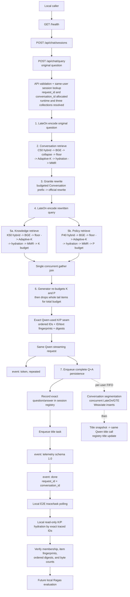

# Local-Only Ragas Evaluation Architecture Audit

## Audit scope and source of truth

This audit traces the repository at commit `fba3c348` without changing runtime
behavior. It defines the evidence boundary for a future, local-only Ragas
evaluation layer. It does not implement or invoke Ragas.

The current checkout has these material properties:

- E2E artifacts use schema `1.3`, phase `2D`.
- The hidden in-memory diagnostic trace uses schema `1.0`, permits one active
  session, retains at most 256 operations, and samples at most 32 items per
  sequence.
- `diagnose e2e` currently rejects a selection larger than 256 queries. The
  proposed schema `1.4`/64-query trace rotation hardening is not present in this
  checkout.
- `diagnostics/queries.py` contains only an empty literal `QUERIES: list[str]`.
  It has no reference-answer or reference-context schema.
- No Ragas dependency or evaluator exists in the repository.

Primary audited anchors at this commit are:

- request admission/SSE/post-generation orchestration:
  `backend/api/chat.py:258-574`;
- seven-step generator pipeline: `backend/rag/pipeline.py:108-257`;
- unified retrieval and final projections: `backend/rag/retrieval.py:662-990`;
- rewrite construction: `backend/rag/query_rewriter.py:51-117`, with the real
  SGLang Granite request/result at
  `backend/providers/sglang_query_rewriter.py:401-525`;
- final combined-budget seam and Qwen stream:
  `backend/rag/generator.py:163-287`;
- Conversation persistence/title work: `backend/rag/embedder.py:189-260`,
  `backend/weaviate_client/conversation.py:72-162`, and
  `backend/rag/session_title.py:61-101`;
- bounded trace storage: `backend/wizard/diagnostics.py:18-21,234-542`;
- current local trace/evidence validation:
  `deployment/e2e_diagnostic_api.py:299-676,892-919,1107-1219`;
- current request artifacts: `deployment/e2e_diagnostic.py:293-451`;
- diagnostic enablement and ordinary ask:
  `deployment/ragctl.py:840-854,1343-1458,1654-1733`;
- K/P physical records and reads:
  `backend/weaviate_client/_chunk_collection.py:105-137,262-332`.

## Protected invariants

The future evaluator must regard the deployed application as authoritative.
It must not change any of the following:

- the seven-step query-pipeline semantics or order;
- Conversation, Knowledge Facts, or Policy retrieval algorithms;
- the fixed C50/K50/P40 first-stage candidate ceilings;
- BGE reranking, relevance floor, Adaptive-K, hydration, MMR, or fallback
  behavior;
- Granite query-rewrite inputs, budgeting, retry/repair behavior, or output
  contract;
- the two query LateOn encodes, model identities, vector shapes, or stored
  vectors;
- the concurrent Knowledge/Policy fork and single `asyncio.gather()` join;
- per-collection or total Qwen context budgeting, prompt semantics, generation
  settings, provider request, retry behavior, or streaming;
- Weaviate schemas, collection contents, or user isolation;
- success-only Conversation indexing, lossless segmentation, or compensation;
- session registry and title behavior;
- per-user FIFO background task ordering or normal asynchronous completion;
- public API models, `token* -> telemetry -> done` SSE ordering, telemetry
  schema `1.0`, or `TIMING_KEYS`;
- normal `./rag up` behavior, Modal topology, runtime dependencies, or
  `backend/requirements.txt`.

Observation and evaluation must add zero retrieval, reranking, embedding,
Granite, Qwen, prompt-construction, queue, or Weaviate mutation calls.

Wizard CRUD Phase 1 has no generated RAG answer. It therefore **must never
invoke Ragas**. Phase 1 remains corpus, isolation, storage, and lifecycle
validation. Ragas applies only to generated-query paths: E2E and an explicitly
evaluated `./rag ask` path.

## Exact successful-query data flow

Important boundaries:

- Conversation retrieval uses the original question and supplies history only
  to Granite. It is not answer-grounding context and must not be placed in
  Ragas `retrieved_contexts`.
- Granite returns the official rewritten string. There is no fallback to the
  original question.
- The K/P output of `retrieve()` is not necessarily the context Qwen receives.
  `generator.py` can drop additional tail items to satisfy the combined prompt
  budget. The accepted final seam is `_trace_final_prompt_context()` after that
  loop terminates.
- Persistence is accepted before the API emits telemetry/done, but persistence
  and title execution remain background work. The diagnostic runner alone
  waits for their existing task records.

## Evaluation evidence matrix

| # | Required value | Exact current location and meaning | Raw text vs. identity evidence | Available to local callers today | Read-only reconstruction after SSE |
|---:|---|---|---|---|---|
| 1 | Original user question | `QueryRequest.question` -> `run_rag_pipeline(... original_query ...)`; E2E `SelectedQuery.question` | Raw text | E2E: yes, top-level `requests.jsonl.question`. `ask`: yes, as its input | No reconstruction is needed. For a successful request it also appears in session state and, after persistence, canonical Conversation `raw_text`; failed requests are not guaranteed to persist it. |
| 2 | Official rewritten Granite query | Return value of `rewrite_query()`, used unchanged for the second LateOn encode, both K/P retrieval branches, and answer generation | Raw text is retained only in an active diagnostic trace as `texts.granite_rewritten_query`, with UTF-8 byte count and framed SHA-256. Trace text is capped at 8 KiB and successful E2E validation requires `truncated=false`. | E2E: yes, nested in `deep_trace.operation.texts`. `ask`: no, because ordinary runtime diagnostics are off and ask sends no trace headers | No. It is absent from SSE, registries, and Weaviate. Recalling Granite would be a duplicate, potentially different model call and is forbidden. It must be captured by the correlated trace used for the real request. |
| 3 | Exact final Knowledge contexts supplied to Qwen | The `knowledge` argument observed by `_trace_final_prompt_context()` only after per-collection and combined-prompt budgeting have completed | Raw text exists transiently in the runtime list and final prompt. The trace emits ordered chunk IDs, per-item `ID + raw_text` fingerprints, aggregate ordered digest, item count, and rendered byte count—not raw context | E2E: identity proof only. `ask`: none | Yes. Fetch each traced chunk ID read-only from the diagnostic user's Knowledge collection, preserve trace order, and verify every fingerprint, aggregate digest, ownership, document membership, and byte count. |
| 4 | Exact final Policy contexts supplied to Qwen | The `policy` argument at the same accepted generator seam | Same as Knowledge | E2E: identity proof only. `ask`: none | Yes, using the Policy collection and the Policy-specific digest domain. |
| 5 | Object/chunk IDs in exact Qwen order | `samples.qwen_knowledge_used_ids` and `samples.qwen_policy_used_ids`; current validator also proves each list/fingerprint list is the exact retained prefix of the corresponding retrieval-final list | IDs plus fingerprints/digests; no raw text | E2E: yes, nested in `deep_trace`. `ask`: no | The order cannot be inferred from physical storage or rerun safely. It must come from the live trace. Once captured, IDs can drive read-only raw-text reconstruction. Knowledge and Policy remain separate ordered lists; the Ragas list is Knowledge followed by Policy. |
| 6 | Raw generated answer | Exact ordered Qwen chunks forwarded as public token events and joined by API/E2E/ask | Raw text plus Qwen/SSE chunk count, byte count, and matching framed digest | E2E: yes, top-level `requests.jsonl.answer`. `ask`: yes, streamed and assembled locally | A successful answer can also be read from the process-local session detail and, after persistence, canonical Conversation storage. The SSE assembly remains the authoritative response for evaluation, including partial failure output. |
| 7 | `request_id` | Generated by request middleware, returned as `X-Request-ID`, and repeated in every public token/telemetry/done payload | UUID, not content | E2E: yes and cross-validated. `ask`: present in SSE payloads, although current ask does not expose a separate structured result | No durable storage mapping guarantees later recovery. Capture and validate it during the request. |
| 8 | `conversation_id` | Allocated before pipeline execution; returned in `done`; used by registry and asynchronous Conversation persistence | UUID, not content | E2E: yes. `ask`: yes in the done payload | On success it can be found in session detail and persisted Conversation objects, but the done event is the authoritative request correlation. It may not persist after a failed stream/task. |
| 9 | Existing latency telemetry | Public telemetry event: schema `1.0` with all fixed `TIMING_KEYS`; E2E additionally records client TTFT/total, bounded deep stages, task timestamps, and verification latency | Numeric values only | E2E: public and deep timing evidence. `ask`: public `TIMING_KEYS` only | No. Timings are observations of that execution and cannot be recreated from stored content. They must be retained from SSE/trace/task timestamps. |
| 10 | Optional reference answer / reference-context IDs | Nowhere. The static loader accepts exactly one literal nonempty `QUERIES: list[str]`; `diagnostics/queries.py` is currently empty | Neither raw references nor IDs exist | No | No. References are author-supplied evaluation data, never derivable from the generated answer or retrieved corpus. A later local query/evaluation schema must add them explicitly and validate reference IDs against the settled Phase 1 corpus. |

### Exact local K/P reconstruction contract

For Ragas, map evidence as follows:

- `user_input`: the original question;
- `response`: the exact assembled public SSE answer;
- `retrieved_contexts`: ordered Qwen-used Knowledge `raw_text` values followed
  by ordered Qwen-used Policy `raw_text` values;
- `reference`: optional, author-supplied reference answer;
- reference-context identity: optional, author-supplied chunk IDs retained as
  labeled metadata and validated against the settled corpus.

Keep labeled Knowledge and Policy arrays alongside the flattened Ragas list so
collection identity is not lost. An empty used list maps to an empty Ragas
context list; fixed prompt fallback wording is not a retrieved document.

The current production trace already provides the exact identity needed for
reconstruction. For each ordered `(chunk_id, raw_text)` pair, local code must:

1. Verify that the UUID belongs to the expected active Phase 1 collection and
   document, and that object UUID equals stored `chunk_id`.
2. Recompute `framed_content_digest("chat-kp-item-v1", [id_utf8, text_utf8])`
   and compare it with the matching traced item fingerprint.
3. Recompute the ordered aggregate with domain
   `chat-qwen-knowledge-context-v1` or
   `chat-qwen-policy-context-v1`, framing the interleaved ID and text bytes.
4. Verify the traced rendered byte count equals the sum of raw UTF-8 byte
   lengths plus two bytes for each `\n\n` separator.
5. Fail closed on missing/extra IDs, collection mismatch, changed text,
   digest mismatch, trace truncation, or external corpus mutation.

The existing exact-by-ID chunk helper retrieves vectors as well as properties,
and the document snapshot discovers IDs through a Weaviate delete dry-run.
Neither is the preferred evaluation primitive. After each trace supplies the
exact used IDs, a later deployment-local reader should fetch those IDs with a
property-only, read-only query using `include_vector=False` and requesting only
`user_id`, `document_id`, `paragraph_id`, `chunk_id`, and `raw_text`. It may
cache already verified immutable records for later queries in the same locked
run, but every cache hit must still satisfy that request's fingerprints and
ordered digest. No vector may enter an artifact.

Rerank scores are not persisted and are not currently present in final-context
trace evidence. They cannot be reconstructed without rerunning BGE, which is
forbidden. They are optional evaluation metadata, not identity evidence; if
later required, they must be observed in bounded diagnostic metadata at the
existing final-context seam without logging raw text.

### Conversation-history evidence

The trace contains ordered Conversation-final IDs, the exact Granite-retained
ID prefix, and aggregate content digests, but not raw Conversation text. The
session detail endpoint cannot reconstruct prior-session/user-wide retrieval
hits, and the current Conversation collection exposes no public snapshot
reader. This does not block Ragas because Conversation history is used only to
produce the rewrite and is excluded from `retrieved_contexts`. It is a separate
rewrite-provenance concern.

## Ordinary `./rag ask` and the minimum compliant path

Ordinary `./rag up` explicitly forces `WIZARD_DIAGNOSTICS_ENABLED=false`, after
scrubbing ambient diagnostic variables. Consequently the hidden router is not
mounted and no trace registry/session exists. Ordinary `./rag ask` sends only
the public SSE request and no trace correlation headers. It can observe the
question, answer, IDs, and public latency telemetry, but not the rewrite or
final K/P identities.

There is no compliant post-hoc reconstruction for an ordinary, untraced ask:

- the Granite rewrite is not persisted;
- Weaviate cannot reveal which ordered items survived request-specific
  Adaptive-K/MMR/budget decisions;
- replaying Granite, retrieval, budgeting, or generation would duplicate the
  pipeline and might produce different evidence.

The smallest future mechanism is an explicit local evaluation mode for ask,
for example `./rag ask --evaluate`, whose default remains off. That mode must
reuse the existing diagnostic deployment/session/correlation machinery: own a
controlled diagnostics-enabled runtime lifecycle for the ask user, start one
bounded trace, issue the real query exactly once with the existing correlation
headers, collect/delete the trace, reconstruct K/P locally, run Ragas locally,
and shut the diagnostic runtime down. It must not add fields to public SSE/API
models or enable diagnostics in ordinary `./rag up`.

If lifecycle ownership is not acceptable for an evaluated ask, exact evidence
cannot be supplied for that path under the stated invariants; the tool must
fail rather than infer or replay it. Formal batch evaluation can use the
existing `./rag diagnose e2e` lifecycle.

## No-change set, smallest later change set, and risks

### Files requiring no changes for Ragas evidence

The following remain authoritative and require no evaluation behavior:

- `backend/api/chat.py`, `backend/api/models.py`, and
  `backend/api/telemetry.py`;
- `backend/rag/pipeline.py`, `retrieval.py`, `query_rewriter.py`,
  `generator.py`, `embedder.py`, and `session_title.py`;
- Granite/Qwen/ONNX provider implementations;
- all `backend/weaviate_client/*`, mappings, and `backend/task_queue.py`;
- `backend/main.py`, `backend/runtime_app.py`, and all Modal application files;
- `backend/requirements.txt` and the Phase 1 Wizard diagnostic/corpus state.

The existing trace is sufficient for the rewrite and final K/P identity. Raw
K/P content must be recovered locally, not added to the Modal trace.

One distinct evidence gap is the effective per-request retrieval-configuration
snapshot. The current trace records observed counts, dimensions, models for
some providers, and timing stages, but not an authoritative complete snapshot
of fusion/alpha, per-collection thresholds/counts, budgets, tokenizer, and all
model/profile identifiers. Local `.env` interpretation is not runtime proof.
If later acceptance requires that snapshot, add one bounded, sanitized,
default-off observation through the **existing** trace using already-loaded
immutable configuration values. It must contain no URL, key, credential,
prompt, vector, or raw context and must not create a second telemetry system.

### Smallest candidate change set for later prompts

1. Extend only local E2E evidence assembly to fetch traced Qwen-used K/P IDs
   through a vector-free read-only helper, verify all existing membership and
   digest evidence, and place raw context plus safe source metadata in
   `requests.jsonl`.
2. Extend the local query/evaluation schema to carry optional reference answers
   and reference chunk IDs while keeping plain `QUERIES` compatibility explicit.
3. Add an `evaluation/` local evaluator module and a separate local-only
   requirements file; lazy-import Ragas only after generation/evidence
   validation.
4. Wire batch evaluation and an explicit evaluated-ask mode in
   `deployment/ragctl.py`, reusing the existing E2E trace client and lifecycle.
5. Only for the configuration gap, add a sanitized snapshot to the existing
   diagnostic operation at already-existing use sites. No raw context should
   cross this boundary.

No evaluator work belongs in a Modal definition, backend request handler,
pipeline function, provider, queue task, or storage mutation.

### Risks and fail-closed rules

- A diagnostics-off or uncorrelated request has irretrievable rewrite/context
  identity and is not evaluable.
- The current 256-operation session limit blocks larger batches until bounded
  trace-session rotation is actually implemented; increasing the registry
  bound is not an acceptable substitute.
- Proof-critical ID sequences over 32 items are truncated by the current trace.
  Evaluation must fail closed rather than weaken exactness. Current default
  K/P final counts (8/5) are within the bound, but configuration permits larger
  final counts up to fixed candidate ceilings.
- A local corpus lock cannot prevent an external writer. Any membership,
  ownership, fingerprint, or aggregate-digest mismatch invalidates the sample.
- Raw contexts and references make local artifacts sensitive. Keep them under
  the existing gitignored `.local/diagnostics/` tree, use restrictive file
  permissions, and never include vectors, prompts, credentials, endpoints,
  provider bodies, or raw errors.
- Fresh chat sessions do not isolate Conversation retrieval because that
  collection is user-wide. This can influence Granite rewrites across runs,
  but it must not contaminate Ragas answer-grounding contexts.
- Reference answers and reference IDs are human/dataset assertions. Never infer
  them from model output or retrieved results.

## Proof that Ragas remains outside Modal

`deployment/modal_runtime.py` builds the inference image exclusively from
`backend/requirements.txt` and copied `backend` source. That requirements file
does not contain Ragas. A future evaluator can therefore remain outside Modal
by enforcing all of the following:

1. Put Ragas and evaluator-only dependencies in a separate local requirements
   file under `evaluation/`; never add them to `backend/requirements.txt`.
2. Import the evaluator only from an explicit local CLI evaluation path, after
   the real SSE response, trace validation, and local evidence reconstruction
   are complete.
3. Do not import `evaluation` from `backend`, `deployment/modal_*.py`, runtime
   startup, providers, or background tasks.
4. Feed Ragas only the immutable local evidence record. It makes no production
   retrieval, embedding, generation, queue, or Weaviate mutation call.
5. Add static dependency/import-boundary tests and diagnostics-off regression
   tests in the later implementation phase.

Under this boundary, Ragas executes in the local launcher/evaluation process
after generation. It cannot affect answer accuracy, selected context, latency
telemetry, persistence, title generation, SSE output, or deployed model call
counts.

## Audit conclusion

No retrieval or generation change is required to construct correct Ragas
inputs for traced E2E requests. The current trace already proves the official
rewrite and exact ordered final K/P identities; a local, read-only,
fingerprint-verified K/P fetch supplies raw contexts without logging them in
Modal. The only hard boundary is ordinary diagnostics-off `./rag ask`: exact
rewrite/context evidence does not exist after the fact, so evaluation must be
an explicit traced mode or fail closed.
