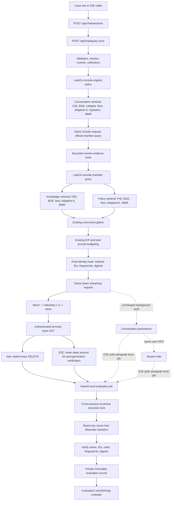

# Local-Only Ragas Evaluation Architecture Audit

## Implemented boundary

Ragas evaluation is an observational, post-generation local workflow. The
deployed application remains the source of truth for questions, rewrites,
retrieval decisions, context budgeting, answers, telemetry, persistence, and
titles. The evaluator consumes immutable evidence only after a successful
public `token* -> telemetry -> done` stream.

There is no evaluation flag on `./rag ask`. Every successful ordinary ask
attempts evaluation automatically. Evidence or evaluator failures remain
informational and cannot change the answer, API status, ask exit status,
conversation persistence, or title work.

The implementation has three deliberately independent bounds:

| Constant | Scope | Current value |
|---|---|---:|
| `TRACE_SESSION_MAX_OPERATIONS` | Operations retained by the one active deep diagnostic session | 256 |
| `EVALUATION_SESSION_CAPACITY` | Concurrent request-scoped metadata-only evidence sessions | 256 |
| `LOCAL_EVALUATION_CONCURRENCY` | Local hydration/Ragas jobs admitted across processes in one checkout | 1 |

The equal numeric values of the first two constants do not make them the same
limit. Deep diagnostics remain a singleton session. Evaluation evidence uses a
bounded session mapping with exactly one `chat_query` operation per session;
faults, terminal publication, lookup, and deletion are scoped to its owner.

Current source anchors:

- concurrent evidence ownership: `backend/wizard/diagnostics.py`,
  `DiagnosticTraceRegistry` and `EVALUATION_SESSION_CAPACITY`;
- conditional integrated-runtime mounting: `backend/runtime_app.py`,
  `create_runtime_app()`;
- official rewrite observation: `backend/providers/sglang_query_rewriter.py`,
  the existing successful rewrite return beside `capture_evaluation_rewrite()`;
- exact final K/P observation: `backend/rag/generator.py`, the successful final
  budget branch beside `capture_evaluation_contexts()`;
- local lock, hydration, record, and child lifecycle:
  `deployment/evaluation_bridge.py`;
- ordinary automatic ask handoff: `deployment/ragctl.py`, `ask()`;
- E2E submission, remote overlap, timing freeze, and join:
  `deployment/e2e_diagnostic_api.py`, `_execute_query()`.

## Protected invariants

Evaluation does not change:

- the seven-step RAG pipeline semantics or order;
- Conversation, Knowledge Facts, or Policy retrieval algorithms;
- the C50/K50/P40 first-stage candidate ceilings;
- BGE reranking, relevance floors, Adaptive-K, hydration, MMR, or fallback;
- Granite rewrite inputs, retry/repair behavior, or output contract;
- query or persistence LateOn/GTE calls, model identities, or vectors;
- the concurrent Knowledge/Policy fork and its single gather join;
- Qwen prompt construction, context budgets, request, retries, or streaming;
- Weaviate schemas, data, ownership, or mutation behavior;
- Conversation indexing, session-title generation, or per-user FIFO queues;
- public API models, SSE bytes/order, telemetry schema `1.0`, or `TIMING_KEYS`;
- Modal topology, production dependencies, or inference call counts.

Observation adds no model, retrieval, reranking, tokenizer, queue, network, or
database call in the inference process. Its two content-aware hooks inspect
values already present at their authoritative use sites, retain bounded
metadata, and shield production from observation failures.

Wizard CRUD Phase 1 produces no generated RAG answer and therefore never
invokes Ragas. It remains corpus, isolation, lifecycle, and storage validation.
Ragas applies only to generated E2E and `./rag ask` requests.

## Exact data flow

Conversation history is rewrite provenance, not answer-grounding context, and
is not placed in Ragas `retrieved_contexts`. The Ragas contexts are precisely
the final Qwen-used Knowledge chunks followed by final Qwen-used Policy chunks,
after every production budget decision.

## Evidence matrix

| Value | Authoritative production location | Retained server evidence | Local caller ownership | Read-only resolution after `done` |
|---|---|---|---|---|
| Original user question | Public query body and `run_rag_pipeline()` input | Not duplicated | E2E selection or ask argument retains exact text | No reconstruction needed |
| Official Granite rewrite | Successful result in `sglang_query_rewriter.py`, used by rewritten-query encoding and K/P retrieval | Exact bounded rewrite, UTF-8 byte count, framed digest | Obtained from the correlated terminal trace | Cannot be reconstructed safely; replay is forbidden |
| Final Knowledge contexts | Final accepted generator budget branch immediately before the existing Qwen stream | Ordered chunk IDs, ID/text fingerprints, collection digest, count, bytes; never raw text | Local bridge receives bounded identity | Fetch exact IDs from user-scoped Knowledge without vectors, then verify |
| Final Policy contexts | Same generator branch | Same evidence, independently collection-scoped | Local bridge receives bounded identity | Fetch exact IDs from Policy and verify |
| Context IDs/order | Exact post-budget Knowledge and Policy lists used to build the accepted prompt | Complete samples up to 32; proof-critical truncation invalidates evaluation | Preserved as separate ordered tuples | Storage cannot recover prompt order; trace order is authoritative |
| Raw generated answer | Public Qwen token events assembled before `done` | No answer text in evaluation evidence | E2E/ask owns exact assembled answer | Persistence is not substituted for the public answer |
| `request_id` | Request middleware/header and every public event | Correlated to the trace operation | Captured and cross-validated locally | Not inferred later |
| `conversation_id` | Allocated request conversation and public `done` | Trace/request correlation plus existing deep evidence | Captured from `done` | Not inferred later |
| Existing latency telemetry | Public telemetry event schema `1.0` | Deep diagnostics retain additional bounded stages; evaluation mode does not | Copied exactly into the evaluation record | Cannot be recomputed |
| Optional reference/reference-context IDs | External human or dataset input only | None | Evaluation record accepts explicit optional provenance | Never fabricated from output or retrieval |

The local hydration query requests only `user_id`, `document_id`,
`paragraph_id`, `chunk_id`, and `raw_text` with `include_vector=False`. It
requires every expected canonical ID exactly once, object UUID equal to chunk
ID, exact user and collection ownership, nonblank text, and—in E2E—the settled
Phase 1 document membership. It restores trace order and recomputes every
`chat-kp-item-v1` fingerprint, collection digest, and rendered UTF-8 byte
count. Missing, duplicated, substituted, moved, or changed content invalidates
evaluation; retrieval is never rerun to approximate it.

## Ordinary ask architecture

Ordinary `./rag up` explicitly deploys:

- `WIZARD_DIAGNOSTICS_ENABLED=false`;
- `RAG_EVALUATION_EVIDENCE_ENABLED=true`;
- `RAG_EVALUATION_USER_ID` equal to loaded ordinary `RAG_USER_ID`.

The full Wizard/E2E trace stays off while the integrated runtime mounts the
same three authenticated hidden endpoints in metadata-only evaluation mode.
`create_app()` remains providerless and generic; conditional mounting occurs
only in `create_runtime_app()`.

Each ask creates its own bounded evidence session and operation, sends the
public query once with correlation headers, validates the unchanged SSE stream,
retrieves terminal evidence, and explicitly deletes that server session. It
deletes the evidence session before waiting for local execution capacity, so a
slow local judge consumes no server evidence slot. Capacity exhaustion, missing
evidence, hydration failure, unavailable Ollama, evaluator timeout, or artifact
failure is an informational evaluation failure after the successful answer.

Concurrent asks retain concurrent inference and request-scoped evidence. They
do not share a singleton evaluation session. Every successful ask makes an
evaluation attempt, subject to the documented finite evidence and local
resource limits.

## Local execution gate and timing

The bridge admits hydration and evaluator work through an exclusive `flock` at
`.local/diagnostics/evaluation/execution.lock`. All ask and E2E processes in
the checkout share it. Acquisition happens before a Weaviate connection is
opened, contexts are hydrated, records are written, or `rag-evaluate` is
spawned. A supervised local worker retains the descriptor and owns the admitted
lifecycle. Required Weaviate configuration travels through private process
input, never command arguments or an artifact. The evaluator child receives an
allowlisted environment that excludes Modal, Weaviate, SGLang, cloud-provider,
proxy, and Python-path credentials or overrides.

Waiting is cancellable and does not consume the 1,800-second admitted execution
deadline. That deadline begins when the lock is acquired and includes hydration,
record construction, evaluator execution, result validation, and cleanup. A
timeout or interruption terminates the admitted process group and reaps its
child before the slot is released. The supervisor enforces an absolute monotonic
deadline, including receipt of private input, while a child deadline handles
unexpected supervisor loss. Inherited descriptors are closed without an explicit
unlock, preserving admission until every remaining owner exits. Cleanup permits
a bounded five-second termination grace (plus a one-second orphan fallback
margin). Each CLI process permits at most one pending evaluation job; E2E remains
sequential. A reported evaluator success additionally requires child exit zero.

For E2E, the job is submitted after successful SSE and deep-evidence validation
but before existing remote persistence/title polling. The remote checks and
local job can overlap. The request row's `duration_ms` freezes at its original
Phase 2D boundary—after remote tasks and postconditions, before evaluator join.
`queue_wait_ms` runs from submission to admission, `execution_ms` runs from
admission through terminal cleanup, and `evaluation_ms` runs from submission to
terminal completion. They are frozen when the job finishes, not when its caller
later joins it. These possibly overlapping intervals are never folded into
public telemetry, E2E `duration_ms`, or RAG latency aggregates.

## Artifacts and failure independence

The isolated evaluator consumes record schema `1.0` and produces result schema
`1.0` in its dedicated Python 3.12 environment.

- E2E: `.local/diagnostics/e2e/<run_id>/evaluation/<sequence>-<request_id>.record.json`
  and `.result.json`, plus an independent evaluation object in the one terminal
  `requests.jsonl` row.
- Ask: `.local/diagnostics/ask/<run_id>/record.json`, `result.json`, and
  `status.json`.
- Shared gate: `.local/diagnostics/evaluation/execution.lock`.

Directories and JSON artifacts are private; existing files are not overwritten.
Records contain exact raw Qwen-used K/P chunks because they are local evaluation
inputs. Server evidence never contains raw K/P contexts, prompts, answers,
vectors, credentials, provider bodies, or raw errors.

An evaluation failure never changes RAG success or E2E batch accounting. No
evaluator runs in `InMemoryTaskQueue`, and local interruption never cancels
remote post-generation work.

## Files requiring no evaluation changes

No evaluation decision or public-contract changes are required in public API
models, telemetry, retrieval algorithms, task-queue implementation, Weaviate
schemas or mutations, Modal model applications, production dependency
manifests, or Phase 1 Wizard/corpus logic.

The only server content observations are additive, exception-shielded reads of
already-existing values in `backend/providers/sglang_query_rewriter.py` and
`backend/rag/generator.py`. Registry/config/runtime composition changes select
the bounded evidence profile without altering the public query path. Local
orchestration lives in `deployment/evaluation_bridge.py`, the existing E2E/ask
callers, and the isolated `evaluation/` project.

## Risks and fail-closed behavior

- More than 256 simultaneous ask evidence sessions produce informational
  evaluation-capacity failures, not RAG failures.
- A proof-critical context sequence over 32 items is rejected rather than
  partially evaluated.
- The single local slot intentionally queues judge work. It never queues or
  serializes inference.
- External corpus mutation between generation and hydration causes an identity
  mismatch; no alternative chunk is substituted.
- Local artifacts contain answer and context text and must remain under the
  gitignored private diagnostic tree.
- Evaluation depends on the dedicated environment, loopback Ollama, and local
  read access to Weaviate. Their failure is observational only.
- E2E retains its current selection bound. Trace rotation and unrelated batch
  statistics are outside this correction.
- Live OFF/ON requests are independent stochastic generations. Answer digests
  are observations, while byte equality is proved only by controlled offline
  tests that replay the same provider stream. An OFF deployment does not expose
  rewrite or context evidence, so the live gate makes no such comparison.

## Proof that Ragas remains outside Modal

The inference image is built only from production backend requirements and
backend source. Ragas and evaluator-only pins live under
`evaluation/pyproject.toml` and `evaluation/uv.lock` in `evaluation/.venv`.

Neither `backend/` nor `deployment/` imports `ragas` or the evaluator package.
The local bridge launches `evaluation/.venv/bin/rag-evaluate` as an external
post-generation process and gives it one immutable local JSON record. The
evaluator contains no RAG request, Modal, SGLang, session, queue, or Weaviate
client. It cannot retry generation, alter selected contexts, affect SSE, write
application storage, or influence persistence/title status.

All judge and evaluation-embedding work therefore remains outside Modal and
the inference process, while the authoritative response remains the one real
production execution.
